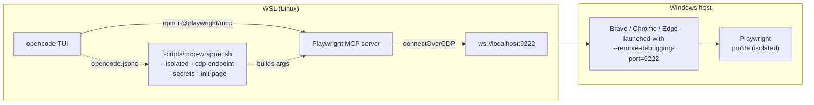

# wsl2-playwright-wrapper

Drive your **visible Windows Chrome/Brave/Edge** from `opencode` running in **WSL2**, over
CDP, without losing a single Playwright command — and keep every LLM session **isolated**.

## How it works (CDP flow)



Flow in words:

1. `opencode.jsonc` tells OpenCode to spawn the wrapper (`bash scripts/mcp-wrapper.sh`).
2. The wrapper builds `npx @playwright/mcp --cdp-endpoint http://localhost:9222 --isolated --caps devtools [--secrets --init-page --storage-state]`.
3. Playwright MCP attaches to the **visible Windows browser** via CDP at `ws://localhost:9222`.
4. Each session gets a **fresh isolated `BrowserContext`** — no cookie bleed between sessions.

## One-command install

From **any** project directory in WSL2 (cloned **globally**, so it's out of your project's git
tracking):

```bash
curl -fsSL https://raw.githubusercontent.com/martinsgmx/wsl2-playwright-wrapper/stable/install.sh | bash
```

It: clones into `~/.opencode/wsl-chrome` → `npm install` (installs the `playwright` dep) →
auto-writes `./opencode.jsonc` pointing OpenCode's MCP at the wrapper (confirms before
overwriting) → creates `~/.opencode/wsl-chrome/.secrets.env` for auth. It **never forks or
replaces `@playwright/mcp`** — you keep every Playwright command.

```bash
# launch a browser, verify, then run opencode
bash ~/.opencode/wsl-chrome/scripts/launch-brave-debug.sh   # BROWSER=auto|chrome|edge
bash ~/.opencode/wsl-chrome/scripts/check-cdp.sh
opencode
# in TUI:  use playwright to navigate to https://example.com/ and report console errors
```

> Overrides: `WSL_PW_INSTALL_DIR`, `WSL_PW_REPO_URL`, `OPENCODE_JSONC` — see `scripts/install.sh`.

## Browser selection

Chromium-family only (Firefox isn't CDP-attachable — it uses WebDriver BiDi).

```bash
bash scripts/launch-brave-debug.sh                 # BROWSER=auto  → Brave (default)
BROWSER=chrome bash scripts/launch-brave-debug.sh  # Chrome
BROWSER=edge  bash scripts/launch-brave-debug.sh   # Edge
```

Each brand uses a **named `Playwright` profile** (`C:\Users\<you>\AppData\Local\Playwright\<browser>`)
so launches never collide with your everyday browser profile — and re-launching while open
reuses the existing CDP session. Override with `CDP_USER_DATA_DIR`.

## The one thing a project needs

If a project already has `@playwright/mcp` installed (`npm i -D @playwright/mcp`), you only
add the CDP endpoint to its `opencode.jsonc` **command**:

```jsonc
{
  "mcp": {
    "playwright": {
      "type": "local",
      "command": [
        "bash",
        "/home/<usernam>/.opencode/wsl2-playwright-wrapper/scripts/mcp-wrapper.sh",
      ],
      "enabled": true,
      "timeout": 10000,
    },
  },
}
```

That fixes the `MCP error -32001: Request timed out` (MCP had no browser to talk to) and keeps
`browser_navigate`, `browser_snapshot`, `browser_click`, `browser_evaluate`,
`browser_console_messages`, `browser_network_requests`, `browser_take_screenshot` — all of them.

## Auth ("isolated" + login)

Every session is `--isolated` (fresh `BrowserContext` → no cookie bleed). To get past a login
gate without typing each time:

- **Auto-fill**: set `AUTH_URL`, `AUTH_USERNAME`, `AUTH_PASSWORD`, `AUTH_SUCCESS_PATH` in
  `.secrets.env`; `init-auth.ts` fills the form until the redirect hits `AUTH_SUCCESS_PATH`.
- **Seed cookies**: `bash scripts/capture-storage-state.sh` → `config/storage-state.json`, so
  future sessions start already logged in.

See `docs/auth.md`.

## Repo layout

```
opencode.jsonc                 # project MCP (local → mcp-wrapper.sh, isolated)
.secrets.env.example           # copy to .secrets.env (gitignored)
config/storage-state.json      # gitignored seed cookies (optional)
scripts/
  install.sh                  # one-command installer (curl|bash → ~/.opencode/wsl-chrome)
  launch-brave-debug.ps1/.cmd/.sh
  wsl-host-ip.sh / check-cdp.sh / mcp-wrapper.sh
  init-auth.ts                # auto-login until AUTH_SUCCESS_PATH
  setup-mcp.sh / capture-storage-state.sh / smoke-test.sh / test-isolated.sh / test-auth.sh
test/fixtures/login/server.js  # tiny login→dashboard fixture
docs/  configuration.md · auth.md · installation.md · install.md · integrate-other-project.md · testing.md · troubleshooting.md
```

## Docs

- Install: `docs/install.md` (one-command) · `docs/installation.md` (manual)
- Config: `docs/configuration.md` · Auth: `docs/auth.md` · Use in another project: `docs/integrate-other-project.md`
- Tests: `docs/testing.md` · Troubleshooting: `docs/troubleshooting.md`
